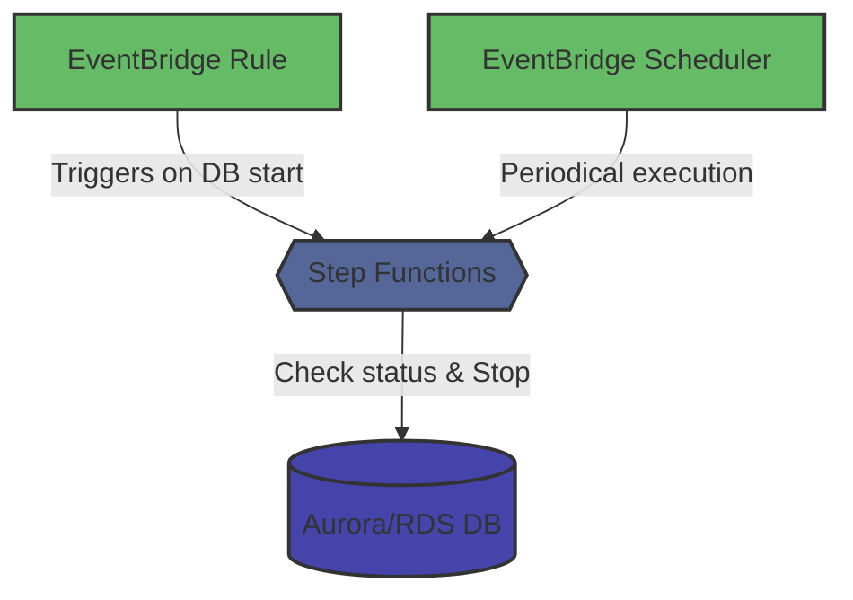

# koreru-toki-no-hiho

koreru-toki-no-hiho (ktnh) is a tool to keep Aurora clusters and RDS instances in a stopped state indefinitely.

## Overview

Amazon Aurora clusters and RDS instances automatically restart after 7 days even when stopped.

koreru-toki-no-hiho is a tool designed to prevent this automatic restart and maintain databases in a stopped state indefinitely.  
This tool creates and manages the necessary AWS resources using CloudFormation.

## Install

```bash
$ go install github.com/quickguard-oss/koreru-toki-no-hiho@latest
```

or you can also download pre-compiled binaries for your platform from the [GitHub Releases page](https://github.com/quickguard-oss/koreru-toki-no-hiho/releases).

## How it works

koreru-toki-no-hiho uses the following AWS services to keep your databases permanently stopped:



| Service               | Description                                                        |
| --------------------- | ------------------------------------------------------------------ |
| Step Functions        | Executes the database stopping workflow                            |
| EventBridge Rule      | Catches Aurora/RDS startup events and triggers the stop process    |
| EventBridge Scheduler | Periodically invokes the stop process as a supplementary mechanism |

1. Step Functions workflow:

   ```mermaid
    stateDiagram-v2
      [*] --> Setup
      Setup --> DescribeDBStatus
      DescribeDBStatus --> CheckDBStatus
      state IfStatus <<choice>>
      CheckDBStatus --> IfStatus
      IfStatus --> WaitForDBAvailable: If DB is starting
      IfStatus --> StopDB: If DB is running
      IfStatus --> DBNotAvailable: If DB is already stopped
      WaitForDBAvailable --> DescribeDBStatus
      StopDB --> [*]
      DBNotAvailable --> [*]
   ```

   - Retrieves the current status of the database
   - If the database is in 'starting' or transitional state, waits for a predefined interval
   - Re-checks the status until the database is fully 'available'
   - Once available, executes the stop command

2. Event detection:

   - EventBridge Rule monitors for Aurora/RDS startup events
   - When detected, it triggers the Step Functions state machine

3. Periodic checks:

   - As a supplementary mechanism, EventBridge Scheduler periodically invokes the same Step Functions state machine
   - This ensures the database remains stopped even if an event was missed

## Usage

```
ktnh prevents Amazon Aurora clusters or RDS instances from automatically restarting after 7 days,
keeping them in a stopped state indefinitely.
It uses CloudFormation to create and manage the necessary AWS resources.

Usage:
  ktnh [command]

Available Commands:
  completion  Generate the autocompletion script for the specified shell
  defrost     Remove indefinite stop configuration for Aurora cluster or RDS instance
  freeze      Keep specified Aurora cluster or RDS instance permanently stopped
  help        Help about any command
  list        List all databases managed by ktnh
  version     Display version information

Flags:
  -h, --help                    help for ktnh
  -j, --json-log                output logs in JSON format instead of plain text
      --no-wait                 don't wait for CloudFormation stack operation to complete
  -p, --prefix string           prefix for CloudFormation stack name (1-10 alphanumeric characters) (default "ktnh")
  -v, --verbose                 enable verbose logging
      --wait-timeout duration   timeout duration for waiting on stack operation (default 15m0s)

Use "ktnh [command] --help" for more information about a command.
```

### Keep a database in a stopped state indefinitely

```bash
$ ktnh freeze <db-identifier>
```

To display only the CloudFormation template without creating a stack:

```bash
$ ktnh freeze <db-identifier> -t
```

To create stack without waiting for completion:

```bash
$ ktnh freeze <db-identifier> --no-wait
```

To specify maximum wait time for stack creation completion:

```bash
$ ktnh freeze <db-identifier> --wait-timeout <duration>
```

### List managed databases

```bash
$ ktnh list
```

### Release a database from indefinite stopped state

```bash
$ ktnh defrost <db-identifier>
```

The `defrost` command supports the same waiting options (`--no-wait`, `--wait-timeout`) as the `freeze` command.

## License

MIT
